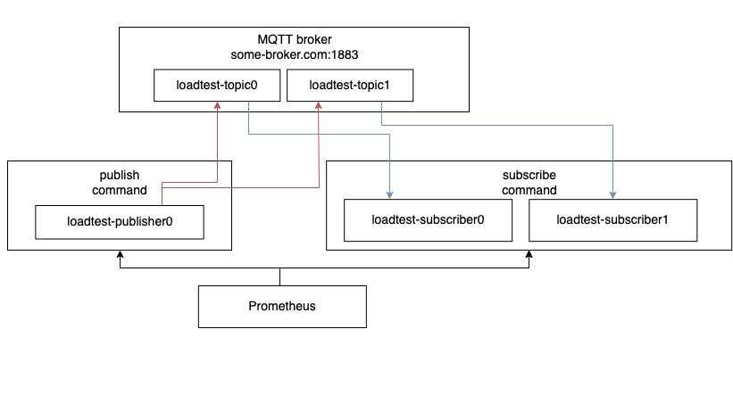

MQTT-loadtest
=============

Capable of creating high amounts of subscribers, publishers and messages to loadtest a MQTT broker.

Features
--------

-	Prometheus metrics
-	Churning (Reconnecting)
-	High amount of subs/pubs possible
-	Low memory usage
-	MQTT 3, 4(3.1.1), 5
-	QoS types<p style="text-align: center;"></p>

Deployment
----------

To run a proper loadtest on a MQTT broker you need to run the subscribe as well as the publish command. These can be run in different manners. The publish command will create a specified amount of publishers and post messages into certain topics.

```bash
mqtt-loadtest publish --topic-prefix loadtest --topic-count 100 --publisher-prefix loadtest-publisher --publisher-count 1 --url 127.0.0.1:1883 --connect-delay 1s --listen-address :8081 --prometheus-enabled --prometheus-path /metrics --log-level debug --clean-session --protocol-version 4 --qos-type 0 --message-rate 40ms
```

The subscribe command will create a specified amount of subscribers and receive messages out of certain topics.

```bash
mqtt-loadtest subscribe --topic-prefix loadtest --topic-count 100 --subscriber-prefix loadtest-subscriber --subscriber-count 1 --url 127.0.0.1:1883 --connect-delay 1s --listen-address :8081 --prometheus-enabled --prometheus-path /metrics --log-level debug --clean-session --protocol-version 4 --churn-rate 1s
```

### Local

Download the binary from the release page or [build](#build-from-source) it from source and execute it with the subscriber and publisher command. For usage information refer to the commands help text.

### Docker

You can run the containers directly or through docker-compose.

```bash
docker run freenow/mqtt-loadtest:latest subscribe --url mqtt_cluster:1883
```

```bash
docker run freenow/mqtt-loadtest:latest publish --url mqtt_cluster:1883
```

Development
-----------

### Build from source

You can build the binary either with [Go](https://golang.org/) installed locally or in [Docker](https://www.docker.com/). For Go in Docker execute `make build_linux` or `make build_darwin` and for local Go `make build_local`.
